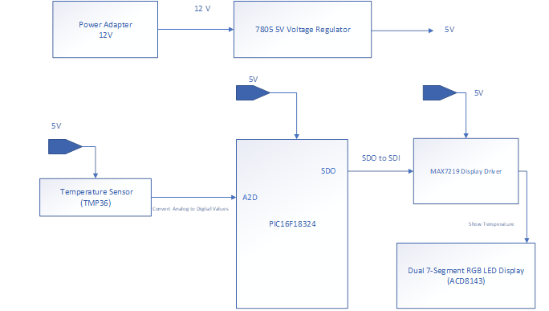
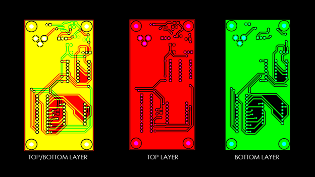

## Digital Thermometer (C / Embedded Systems)
#### *Mar 2018 - May 2018 | San Diego State University*
##### A digital thermometer using a PIC16F18324 microcontroller.
##### [GitHub Page](https://github.com/pbiglete/DigitalThermometer)
---

***Senior Design A Project***   
▪ Designed a digital thermometer that displays temperature on a dual 7-segment display.  
▪ Used Mentor Graphics Design Capture to design the PCB board. 
▪ Worked with a PIC16F18324 Microcontroller. 
▪ Utilized SPI communication to control the Display Driver from the Microcontroller. 

---

**Block Diagram - Figure 1**  

**Schematic - Figure 2**  

**PCB - Figure 3**  

