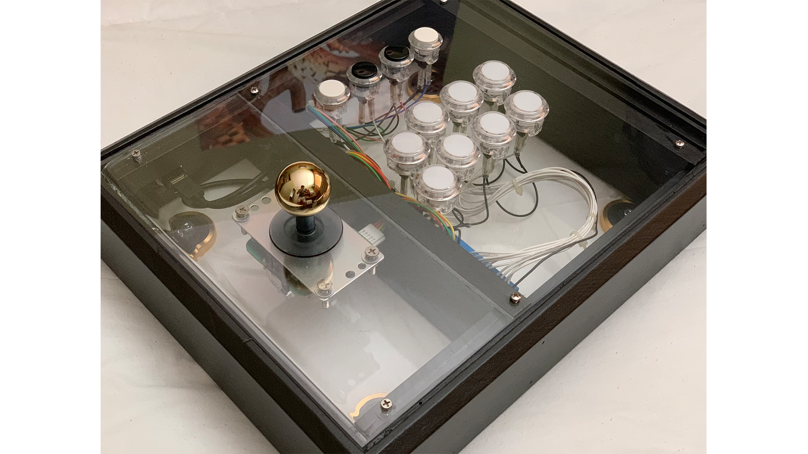
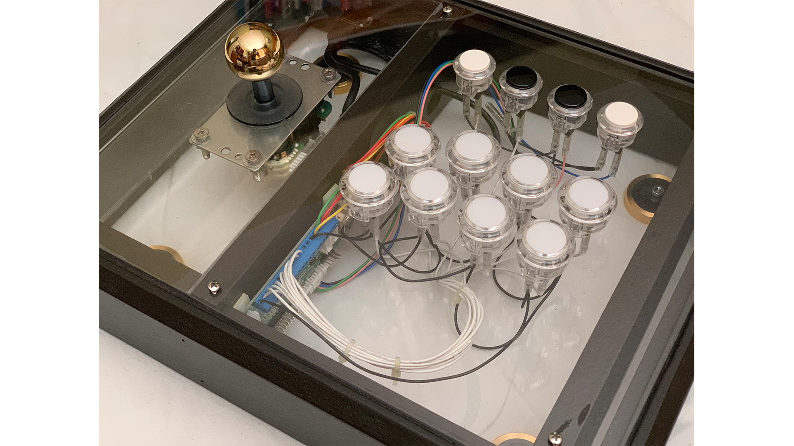
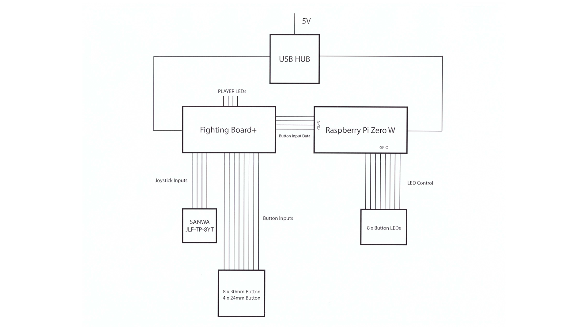

## Smart Arcade Controller (Python / Raspberry Pi Zero W)
#### *June 2019 - Present | San Diego, CA*
#### [Github Link](https://github.com/pbiglete/SmartArcadeController)
##### An arcade controller that tracks players input data in real time, provides user statistics and helps the user learn button and directional combinations for specific games.

---

An arcade controller system that tracks a user’s button input data in real time using a Pi Zero W connected to a Fighting Board+ and provides statistical analysis on a user’s controller behavior while playing a game such as button press patterns / timings and activity level.  

---

**Prototype Controller**
  

**Block Diagram**

