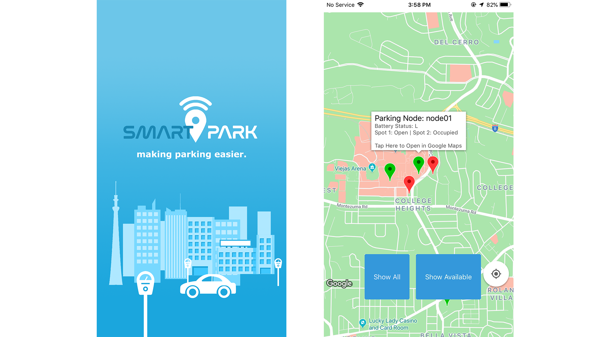

## SmartPark - A Wireless Parking Solution (C# / Swift)
#### *Aug 2018 - Dec 2018 | San Diego State University*
##### A wireless parking solution that helps make finding parking easier.
---
***Senior Design B Project***  
**Role: Project Manager & Programming Lead**  
-Led a team of 7 people. 
-Designed and developed the iOS application that retrieved real-time parking data from a database and displayed it on a map using the Google Maps API. 
-Provided debugging and programming support for team members. 

---
[Senior Design B - Fall 2018 Poster](https://drive.google.com/file/d/19q4_MOXabJU76NdPOIdz-spOaZ17A6BQ/view?usp=sharing)  
[Senior Design B - Project Brochure](https://drive.google.com/file/d/1yCnVpcq2uabE7Gb4d0NHPzmSpjyD10Gy/view?usp=sharing)  

  

***Abstract:***  
As cities continue to grow and progress through technology, so do the problems of being able to accommodate its citizens. SmartPark is an inexpensive design that improves traffic flow and congestion caused from drivers looking for parking, mainly in large cities. During peak hours, finding parking can be time-consuming and frustrating for people. SmartPark uses ultrasonic sensors per parking space, and allows users to locate and navigate to available spaces through our iOS application. If the parking spot they are navigating to becomes occupied, the app automatically redirects them to the next available spot.